# Use-case Diagrams — Plant Care Backend

Sơ đồ luồng nghiệp vụ cho từng use case trong [`docs/spec.md`](spec.md) (§2), ánh xạ
chính xác tới API hiện có (xem [`docs/api-guide.md`](api-guide.md)). Mỗi sơ đồ
sequence thể hiện: endpoint thật (method + path), status code thật (2xx/4xx), và các
side effect đã xác minh trong `app/services/` (notification, cập nhật tồn kho, tính
diện tích PostGIS, rate limit Redis, presigned URL MinIO, chống trùng `client_uuid`...).

Tổng cộng **22 use case** — mọi endpoint nhắc tới đều được đối chiếu tự động với
OpenAPI spec của server; tài liệu này cập nhật theo mã nguồn tại thời điểm 2026-07-21.

**Chủ vườn — Admin Web**

- UC-01 — Đăng ký / Đăng nhập (Owner Registration & Login)
- UC-02 — Tạo và quản lý vườn (Create & manage gardens)
- UC-03 — Vẽ sơ đồ vườn (Draw garden boundary & zone grid)
- UC-04 — Quản lý danh sách cây (Plant List Management and Identifier Assignment)
- UC-05 — In mã định danh (Print QR/Barcode Identifiers)
- UC-06 — Xem lịch sử cây (View Full Plant History)
- UC-07 — Xem báo cáo tổng hợp (Garden dashboard statistics)
- UC-08 — AI tổng hợp thông tin (AI garden summary)
- UC-09 — Quản lý nhân viên (Staff management)
- UC-10 — Lập lịch chăm sóc (Care schedules CRUD, cron)
- UC-11 — Giao việc cho nhân viên (Owner creates, assigns and tracks tasks)
- UC-12 — Quản lý kho vật tư (Inventory management)
- UC-13 — Quản lý thu hoạch (Harvest records & season yield stats)
- UC-14 — Truy xuất nguồn gốc (Owner mints and manages traceability QR codes)

**Nhân viên — Mobile App**

- UC-20 — Đăng nhập (Staff Login on Mobile)
- UC-21 — Quét mã cây (Scan Plant Tag)
- UC-22 — Báo cáo tình trạng cây (Report Plant Condition)
- UC-23 — Xem lịch sử cây (Quick Plant History After Scan)
- UC-24 — Nhận và thực hiện task (Staff receives and performs tasks)
- UC-25 — Hỗ trợ Offline (Offline Support & Sync)
- UC-26 — AI chẩn đoán bệnh (AI Leaf-Disease Diagnosis)

**Khách / Người tiêu dùng**

- UC-30 — Quét QR truy xuất (Consumer scans product QR — public trace page)

---

## UC-01 — Đăng ký / Đăng nhập (Owner Registration & Login)

Chủ vườn (Owner) tự đăng ký tài khoản trên Admin Web và đăng nhập vào hệ thống. `POST /api/auth/register` là public và **luôn tạo tài khoản role `OWNER`** (nhân viên không tự đăng ký được — xem UC-20); yêu cầu có ít nhất email hoặc SĐT (thiếu cả hai → 422), email được chuẩn hoá lowercase, mật khẩu 8–128 ký tự băm bằng Argon2. Đăng nhập bằng `identifier` (email hoặc SĐT) trả về cặp JWT stateless — access token 30 phút, refresh token 30 ngày; mỗi lần `POST /api/auth/refresh` phát hành một cặp token hoàn toàn mới (xoay vòng phía client, không có danh sách thu hồi phía server). Khi so khớp mật khẩu với tài khoản không tồn tại, server vẫn verify với một dummy-hash để thời gian phản hồi không tiết lộ tài khoản có tồn tại hay không.

**APIs:** `POST /api/auth/register`, `POST /api/auth/login`, `POST /api/auth/refresh`, `GET /api/auth/me`

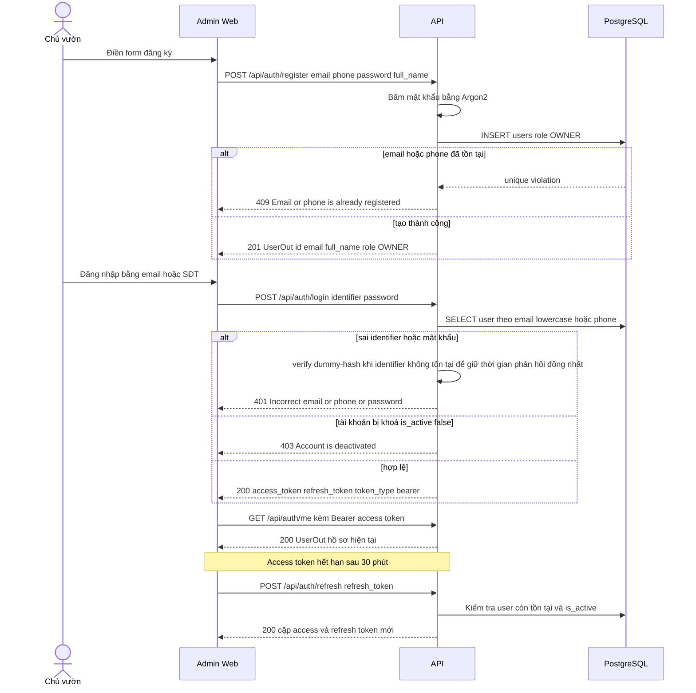
```mermaid
sequenceDiagram
  actor O as Chủ vườn
  participant W as Admin Web
  participant A as API
  participant P as PostgreSQL
  O->>W: Điền form đăng ký
  W->>A: POST /api/auth/register email phone password full_name
  A->>A: Băm mật khẩu bằng Argon2
  A->>P: INSERT users role OWNER
  alt email hoặc phone đã tồn tại
    P-->>A: unique violation
    A-->>W: 409 Email or phone is already registered
  else tạo thành công
    A-->>W: 201 UserOut id email full_name role OWNER
  end
  O->>W: Đăng nhập bằng email hoặc SĐT
  W->>A: POST /api/auth/login identifier password
  A->>P: SELECT user theo email lowercase hoặc phone
  alt sai identifier hoặc mật khẩu
    A->>A: verify dummy-hash khi identifier không tồn tại để giữ thời gian phản hồi đồng nhất
    A-->>W: 401 Incorrect email or phone or password
  else tài khoản bị khoá is_active false
    A-->>W: 403 Account is deactivated
  else hợp lệ
    A-->>W: 200 access_token refresh_token token_type bearer
  end
  W->>A: GET /api/auth/me kèm Bearer access token
  A-->>W: 200 UserOut hồ sơ hiện tại
  Note over W,A: Access token hết hạn sau 30 phút
  W->>A: POST /api/auth/refresh refresh_token
  A->>P: Kiểm tra user còn tồn tại và is_active
  A-->>W: 200 cặp access và refresh token mới
```

Nhánh lỗi bổ sung không vẽ trong sơ đồ: `422` khi body thiếu cả email lẫn phone, mật khẩu ngoài khoảng 8–128 ký tự, hoặc phone không khớp pattern `^\+?[0-9]{8,15}$`; `401 Invalid or expired refresh token` khi refresh token sai chữ ký, hết hạn, sai loại token (dùng nhầm access token), hoặc user đã bị vô hiệu hoá.

---

## UC-02 — Tạo và quản lý vườn (Create & manage gardens)

Chủ vườn (Owner) dùng Admin Web để tạo vườn mới (tên, địa chỉ, loại cây) rồi xem danh sách, xem chi tiết, sửa hoặc xóa vườn. Chỉ tài khoản OWNER được tạo/sửa/xóa; Nhân viên (Staff, Mobile App) chỉ nhìn thấy các vườn mà họ có ít nhất một phân công khu vực (zone assignment) và chỉ được đọc. Danh sách trả về bản tóm tắt (không kèm boundary); chi tiết trả về cả boundary dạng GeoJSON qua `ST_AsGeoJSON`.

**APIs:** `POST /api/gardens`, `GET /api/gardens`, `GET /api/gardens/{garden_id}`, `PUT /api/gardens/{garden_id}`, `DELETE /api/gardens/{garden_id}`

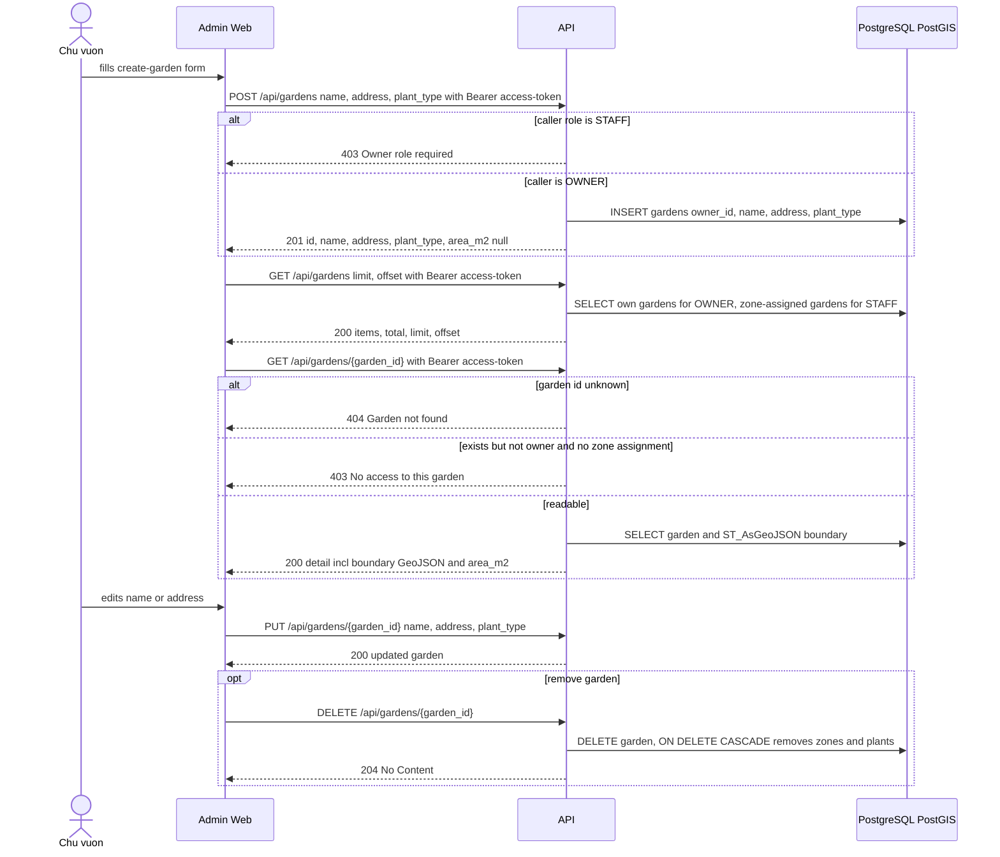
```mermaid
sequenceDiagram
  actor O as Chu vuon
  participant W as Admin Web
  participant A as API
  participant P as PostgreSQL PostGIS
  O->>W: fills create-garden form
  W->>A: POST /api/gardens name, address, plant_type with Bearer access-token
  alt caller role is STAFF
    A-->>W: 403 Owner role required
  else caller is OWNER
    A->>P: INSERT gardens owner_id, name, address, plant_type
    A-->>W: 201 id, name, address, plant_type, area_m2 null
  end
  W->>A: GET /api/gardens limit, offset with Bearer access-token
  A->>P: SELECT own gardens for OWNER, zone-assigned gardens for STAFF
  A-->>W: 200 items, total, limit, offset
  W->>A: GET /api/gardens/{garden_id} with Bearer access-token
  alt garden id unknown
    A-->>W: 404 Garden not found
  else exists but not owner and no zone assignment
    A-->>W: 403 No access to this garden
  else readable
    A->>P: SELECT garden and ST_AsGeoJSON boundary
    A-->>W: 200 detail incl boundary GeoJSON and area_m2
  end
  O->>W: edits name or address
  W->>A: PUT /api/gardens/{garden_id} name, address, plant_type
  A-->>W: 200 updated garden
  opt remove garden
    W->>A: DELETE /api/gardens/{garden_id}
    A->>P: DELETE garden, ON DELETE CASCADE removes zones and plants
    A-->>W: 204 No Content
  end
```

Quy ước lỗi đã xác minh trong `app/core/permissions.py`: 404 khi vườn không tồn tại, 403 khi tồn tại nhưng không phải của chủ gọi (`Not your garden` cho thao tác ghi, `No access to this garden` cho đọc). Tạo vườn không nhận `area_m2` từ client — diện tích chỉ được server tính ở UC-03 khi vẽ boundary.

---

## UC-03 — Vẽ sơ đồ vườn (Draw garden boundary & zone grid)

Chủ vườn (Owner) mở bản đồ Mapbox/Google Maps trong Admin Web, vẽ polygon bao quanh ranh giới vườn thực tế rồi gửi lên dạng GeoJSON Polygon (EPSG:4326). Server lưu boundary vào cột PostGIS `GEOMETRY(POLYGON, 4326)` và tự tính `area_m2` bằng `ST_Area(geography(boundary))` — client không bao giờ tự gửi diện tích. Sau đó chủ vườn chia vườn thành các khu (zone grid) bằng CRUD zones; tên zone là duy nhất trong từng vườn (`uq_zones_garden_id_name`).

**APIs:** `PUT /api/gardens/{garden_id}/boundary`, `GET /api/gardens/{garden_id}`, `POST /api/gardens/{garden_id}/zones`, `GET /api/gardens/{garden_id}/zones`, `PUT /api/zones/{zone_id}`, `DELETE /api/zones/{zone_id}`

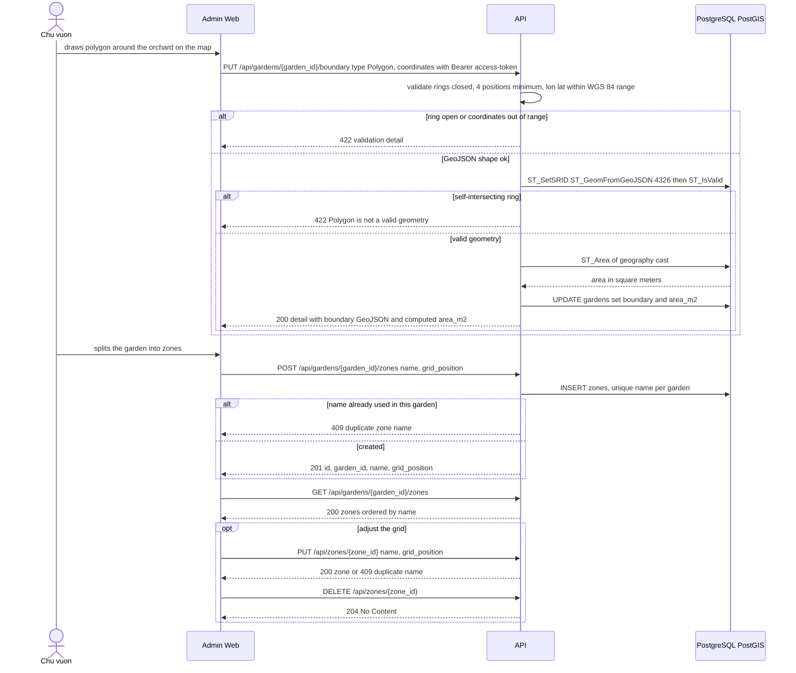
```mermaid
sequenceDiagram
  actor O as Chu vuon
  participant W as Admin Web
  participant A as API
  participant P as PostgreSQL PostGIS
  O->>W: draws polygon around the orchard on the map
  W->>A: PUT /api/gardens/{garden_id}/boundary type Polygon, coordinates with Bearer access-token
  A->>A: validate rings closed, 4 positions minimum, lon lat within WGS 84 range
  alt ring open or coordinates out of range
    A-->>W: 422 validation detail
  else GeoJSON shape ok
    A->>P: ST_SetSRID ST_GeomFromGeoJSON 4326 then ST_IsValid
    alt self-intersecting ring
      A-->>W: 422 Polygon is not a valid geometry
    else valid geometry
      A->>P: ST_Area of geography cast
      P-->>A: area in square meters
      A->>P: UPDATE gardens set boundary and area_m2
      A-->>W: 200 detail with boundary GeoJSON and computed area_m2
    end
  end
  O->>W: splits the garden into zones
  W->>A: POST /api/gardens/{garden_id}/zones name, grid_position
  A->>P: INSERT zones, unique name per garden
  alt name already used in this garden
    A-->>W: 409 duplicate zone name
  else created
    A-->>W: 201 id, garden_id, name, grid_position
  end
  W->>A: GET /api/gardens/{garden_id}/zones
  A-->>W: 200 zones ordered by name
  opt adjust the grid
    W->>A: PUT /api/zones/{zone_id} name, grid_position
    A-->>W: 200 zone or 409 duplicate name
    W->>A: DELETE /api/zones/{zone_id}
    A-->>W: 204 No Content
  end
```

Đường ống kiểm tra boundary có ba tầng, tất cả đều trả 422 (xác minh trong `app/services/garden_service.py`):

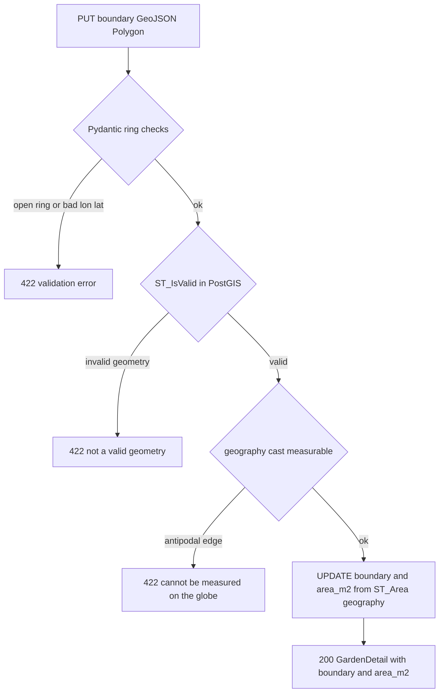
```mermaid
flowchart TD
  S[PUT boundary GeoJSON Polygon] --> V1{Pydantic ring checks}
  V1 -- open ring or bad lon lat --> E1[422 validation error]
  V1 -- ok --> V2{ST_IsValid in PostGIS}
  V2 -- invalid geometry --> E2[422 not a valid geometry]
  V2 -- valid --> V3{geography cast measurable}
  V3 -- antipodal edge --> E3[422 cannot be measured on the globe]
  V3 -- ok --> U[UPDATE boundary and area_m2 from ST_Area geography]
  U --> R[200 GardenDetail with boundary and area_m2]
```

Ghi chú đã xác minh trong code: mọi endpoint ghi (`boundary`, zones) yêu cầu chủ sở hữu vườn (`OwnedGarden` / `OwnedZone` — 404 nếu không tồn tại, 403 nếu vườn của người khác); `GET zones` cho phép cả staff được phân công đọc (`ReadableGarden`). Nếu vườn bị xóa đồng thời ngay trước khi INSERT zone, FK violation được ánh xạ thành 404 Garden not found thay vì 409. Việc chia lưới tự động theo số cây (spec §4.1 bước 4-6) diễn ra phía client; backend chỉ nhận kết quả là các zone có `name` và `grid_position`.

---

## UC-04 — Quản lý danh sách cây (Plant List Management and Identifier Assignment)

Chủ vườn (Owner) trên Admin Web xem danh sách cây của một vườn (lọc theo trạng thái, khu, mã cây, phân trang), tạo cây đơn lẻ hoặc sinh hàng loạt theo lưới ô với mã tuần tự kiểu `SR-K01-001`, sửa/xóa cây, và gán mã định danh vật lý (tag QR/Barcode) cho từng cây. Nhân viên (Staff) được phân công vào một khu của vườn chỉ có quyền đọc danh sách và chi tiết cây (`ReadableGarden`/`ReadablePlant`); mọi thao tác ghi là owner-only — người khác nhận `403`.

**APIs:** `GET /api/gardens/{garden_id}/plants`, `POST /api/gardens/{garden_id}/plants`, `POST /api/gardens/{garden_id}/plants/bulk`, `GET /api/plants/{plant_id}`, `PUT /api/plants/{plant_id}`, `DELETE /api/plants/{plant_id}`, `POST /api/plants/{plant_id}/tags`

Hành vi đã xác minh trong code (`app/services/plant_service.py`, `app/services/tag_service.py`):

- **List** trả về phong bì phân trang `{items, total, limit, offset}` (limit 1–100, mặc định 20); lọc `status`, `zone_id`, và `code` khớp chuỗi con không phân biệt hoa thường (`ILIKE %code%`), sắp xếp theo `code`.
- **Create** (`201`): `code` 1–16 ký tự, duy nhất trong vườn — trùng trả `409`; `zone_id` phải thuộc đúng vườn, sai trả `422`; `status` mặc định `UNKNOWN`.
- **Bulk create** (`201`): sinh `count` (1–500) mã dạng `{code_prefix}-{NNN}` từ `start_index` (mặc định 1), zero-pad với độ rộng `max(3, len(chỉ số cuối))`; `code_prefix` ≤ 12 ký tự và mã sinh ra vượt 16 ký tự trả `422`; cả lô là một transaction — chỉ một mã đụng độ là toàn bộ rollback với `409`.
- **Update** (`200`): đổi `status` phải hợp lệ theo máy trạng thái §4.7 (bên dưới), vi phạm trả `409 Illegal plant status transition`; đổi `code` trùng trả `409`; `DELETE` trả `204`.
- **Gán mã định danh** (`POST /api/plants/{plant_id}/tags`, `201`): mỗi cây chỉ có một tag `ACTIVE` (partial unique index) và `tag_code` duy nhất toàn hệ thống — vi phạm cái nào cũng trả `409` (có backstop bắt `IntegrityError` cho race ghi đồng thời).

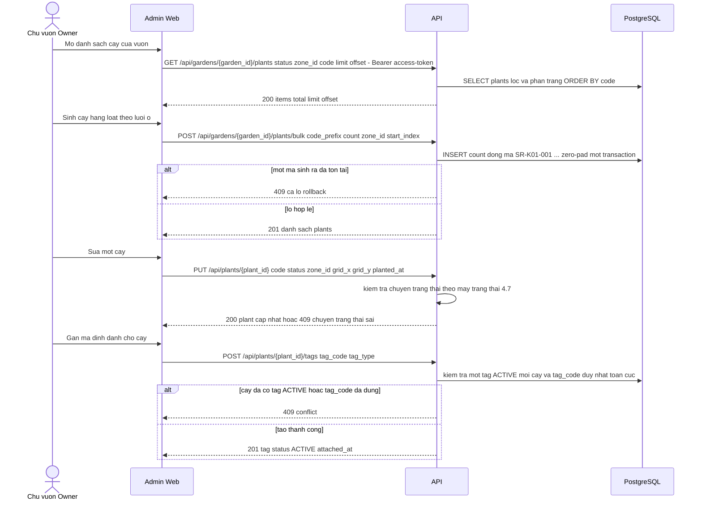
```mermaid
sequenceDiagram
  actor O as Chu vuon Owner
  participant W as Admin Web
  participant A as API
  participant P as PostgreSQL
  O->>W: Mo danh sach cay cua vuon
  W->>A: GET /api/gardens/{garden_id}/plants status zone_id code limit offset - Bearer access-token
  A->>P: SELECT plants loc va phan trang ORDER BY code
  A-->>W: 200 items total limit offset
  O->>W: Sinh cay hang loat theo luoi o
  W->>A: POST /api/gardens/{garden_id}/plants/bulk code_prefix count zone_id start_index
  A->>P: INSERT count dong ma SR-K01-001 ... zero-pad mot transaction
  alt mot ma sinh ra da ton tai
    A-->>W: 409 ca lo rollback
  else lo hop le
    A-->>W: 201 danh sach plants
  end
  O->>W: Sua mot cay
  W->>A: PUT /api/plants/{plant_id} code status zone_id grid_x grid_y planted_at
  A->>A: kiem tra chuyen trang thai theo may trang thai 4.7
  A-->>W: 200 plant cap nhat hoac 409 chuyen trang thai sai
  O->>W: Gan ma dinh danh cho cay
  W->>A: POST /api/plants/{plant_id}/tags tag_code tag_type
  A->>P: kiem tra mot tag ACTIVE moi cay va tag_code duy nhat toan cuc
  alt cay da co tag ACTIVE hoac tag_code da dung
    A-->>W: 409 conflict
  else tao thanh cong
    A-->>W: 201 tag status ACTIVE attached_at
  end
```

Máy trạng thái cây được `PUT /api/plants/{plant_id}` cưỡng chế (`ALLOWED_STATUS_TRANSITIONS`, mọi bước sai trả `409`; `DEAD` là trạng thái kết thúc):

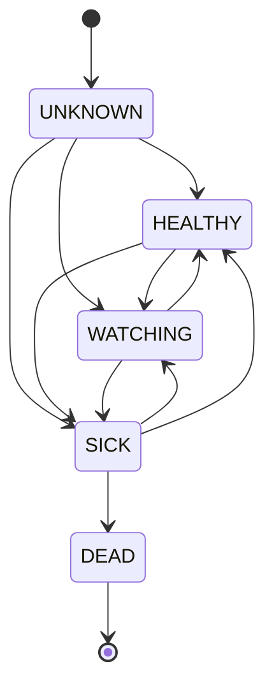
```mermaid
stateDiagram-v2
  [*] --> UNKNOWN
  UNKNOWN --> HEALTHY
  UNKNOWN --> WATCHING
  UNKNOWN --> SICK
  HEALTHY --> WATCHING
  HEALTHY --> SICK
  WATCHING --> HEALTHY
  WATCHING --> SICK
  SICK --> WATCHING
  SICK --> HEALTHY
  SICK --> DEAD
  DEAD --> [*]
```

---

## UC-05 — In mã định danh (Print QR/Barcode Identifiers)

Chủ vườn (Owner) trên Admin Web chọn cây từ danh sách, sinh và in QR Code/Barcode (hàng loạt hoặc từng cái, decal chống nước — §4.1 Bước 3), rồi đăng ký từng mã đã in vào hệ thống bằng cách gán tag cho cây; Nhân viên (Staff) trên Mobile App gắn tag ngoài vườn và quét để xác nhận mã phân giải đúng cây. Backend không render ảnh QR/Barcode — Admin Web sinh ảnh phía client (spec §5: `qrcode` + `jsbarcode`, in PDF bằng `react-pdf`); vai trò của backend là sổ đăng ký `tag_code` và vòng đời tag.

**APIs:** `GET /api/gardens/{garden_id}/plants`, `POST /api/plants/{plant_id}/tags`, `GET /api/tags/lookup/{code}`, `PUT /api/tags/{tag_id}/replace`

Ngữ nghĩa `tag_code` (xác minh trong `app/schemas/tag.py`, `app/services/tag_service.py`):

- `tag_code` là chuỗi 1–32 ký tự **được mã hóa nguyên văn trong QR/Barcode** — chính là payload máy quét đọc ra; `tag_type` là `QR` hoặc `BARCODE` (mặc định `QR`).
- `tag_code` **duy nhất toàn hệ thống** (không chỉ trong một vườn) nên một lần quét phân giải được cây mà không cần ngữ cảnh vườn; trùng mã trả `409`.
- Mỗi cây chỉ có **một tag `ACTIVE`** tại một thời điểm (partial unique index); tách biệt với `plants.code` (mã nghiệp vụ ≤16 ký tự) — một cây có thể qua nhiều tag vật lý nhưng giữ nguyên mã cây.
- `GET /api/tags/lookup/{code}` (Bearer) trả `200` với `{tag, plant, garden, recent_logs}` (5 log gần nhất); mã không tồn tại **hoặc** thuộc tenant khác đều trả `404 Tag not found` để không lộ sự tồn tại của tag giữa các vườn.

Luồng thay tag hỏng/mất (§4.5, `PUT /api/tags/{tag_id}/replace`, owner-only qua `OwnedTag`): chỉ tag `ACTIVE` mới thay được (`409` nếu không); mã mới trùng trả `409`. Trong **một transaction**: tag cũ chuyển `status = REPLACED` với `replaced_at = now()` trước (giải phóng partial unique index), chèn tag mới `ACTIVE` cùng `plant_id`, rồi ghi `replaced_by = id tag mới` — audit trail đầy đủ mã cũ/mã mới/thời điểm. Phản hồi `200 {old_tag, new_tag}`. Lưu ý: văn xuôi §4.5 viết tag cũ thành "DEAD", nhưng trạng thái thực tế trong enum và code là `REPLACED`; hai giá trị enum `DAMAGED`/`LOST` được khai báo trong `tag_status` nhưng hiện chưa có endpoint nào đặt chúng.

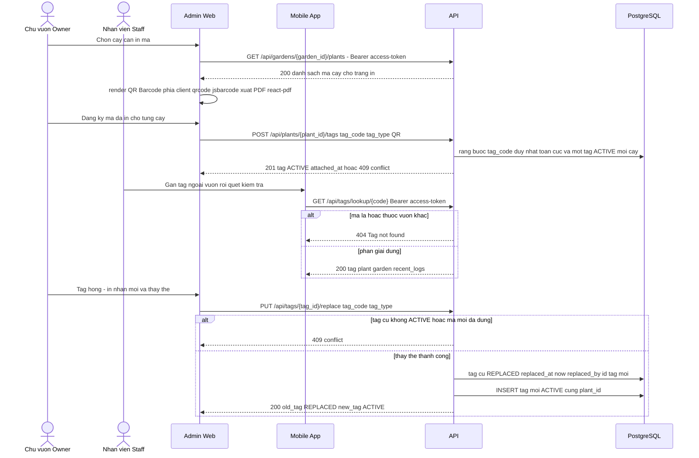
```mermaid
sequenceDiagram
  actor O as Chu vuon Owner
  actor S as Nhan vien Staff
  participant W as Admin Web
  participant M as Mobile App
  participant A as API
  participant P as PostgreSQL
  O->>W: Chon cay can in ma
  W->>A: GET /api/gardens/{garden_id}/plants - Bearer access-token
  A-->>W: 200 danh sach ma cay cho trang in
  W->>W: render QR Barcode phia client qrcode jsbarcode xuat PDF react-pdf
  O->>W: Dang ky ma da in cho tung cay
  W->>A: POST /api/plants/{plant_id}/tags tag_code tag_type QR
  A->>P: rang buoc tag_code duy nhat toan cuc va mot tag ACTIVE moi cay
  A-->>W: 201 tag ACTIVE attached_at hoac 409 conflict
  S->>M: Gan tag ngoai vuon roi quet kiem tra
  M->>A: GET /api/tags/lookup/{code} Bearer access-token
  alt ma la hoac thuoc vuon khac
    A-->>M: 404 Tag not found
  else phan giai dung
    A-->>M: 200 tag plant garden recent_logs
  end
  O->>W: Tag hong - in nhan moi va thay the
  W->>A: PUT /api/tags/{tag_id}/replace tag_code tag_type
  alt tag cu khong ACTIVE hoac ma moi da dung
    A-->>W: 409 conflict
  else thay the thanh cong
    A->>P: tag cu REPLACED replaced_at now replaced_by id tag moi
    A->>P: INSERT tag moi ACTIVE cung plant_id
    A-->>W: 200 old_tag REPLACED new_tag ACTIVE
  end
```

Vòng đời tag do API cưỡng chế (một transaction cho bước thay thế):

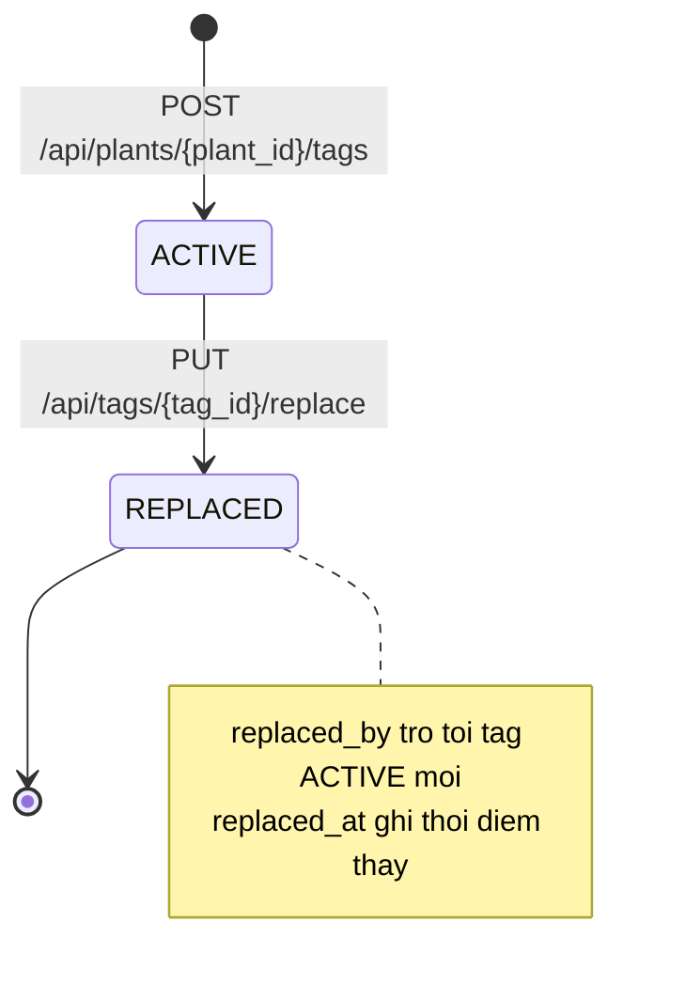
```mermaid
stateDiagram-v2
  [*] --> ACTIVE : POST /api/plants/{plant_id}/tags
  ACTIVE --> REPLACED : PUT /api/tags/{tag_id}/replace
  REPLACED --> [*]
  note right of REPLACED
    replaced_by tro toi tag ACTIVE moi
    replaced_at ghi thoi diem thay
  end note
```

---

## UC-06 — Xem lịch sử cây (View Full Plant History)

Chủ vườn (Owner) on the Admin Web clicks into a plant to inspect its complete care history — every field report with photos, notes, status changes, the reporter's name, and any AI diagnoses attached to a report (spec §4.2: "Chủ click vào cây cụ thể để xem timeline"). `GET /api/plants/{plant_id}/timeline` returns the log history newest-first (`created_at DESC, id DESC`) with each entry as `{log, reporter_name}` — the reporter's `full_name` is joined from `users`, and each log eager-loads its attached AI diagnoses; `GET /api/plants/{plant_id}/logs` is the same paginated history without the reporter join. Both endpoints use the ReadablePlant rule (garden owner, or STAFF assigned to a zone in the plant's garden — 404 if the plant is missing, 403 if it exists but is inaccessible), so the identical endpoints also power UC-23 on mobile. Pagination is `limit` 1–100 (default 20) and `offset` ≥ 0; report photos are stored as MinIO object URLs which the browser fetches directly for display.

**APIs:** `GET /api/plants/{plant_id}`, `GET /api/plants/{plant_id}/timeline`, `GET /api/plants/{plant_id}/logs`

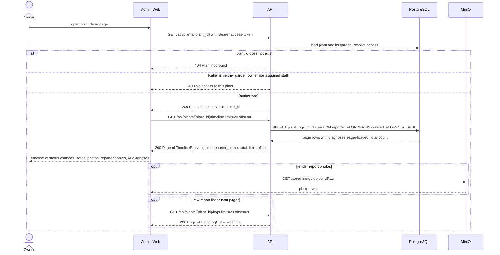
```mermaid
sequenceDiagram
  actor O as Owner
  participant W as Admin Web
  participant A as API
  participant P as PostgreSQL
  participant S3 as MinIO
  O->>W: open plant detail page
  W->>A: GET /api/plants/{plant_id} with Bearer access-token
  A->>P: load plant and its garden, resolve access
  alt plant id does not exist
    A-->>W: 404 Plant not found
  else caller is neither garden owner nor assigned staff
    A-->>W: 403 No access to this plant
  else authorized
    A-->>W: 200 PlantOut code, status, zone_id
    W->>A: GET /api/plants/{plant_id}/timeline limit=20 offset=0
    A->>P: SELECT plant_logs JOIN users ON reporter_id ORDER BY created_at DESC, id DESC
    P-->>A: page rows with diagnoses eager-loaded, total count
    A-->>W: 200 Page of TimelineEntry log plus reporter_name, total, limit, offset
    W-->>O: timeline of status changes, notes, photos, reporter names, AI diagnoses
    opt render report photos
      W->>S3: GET stored image object URLs
      S3-->>W: photo bytes
    end
    opt raw report list or next pages
      W->>A: GET /api/plants/{plant_id}/logs limit=20 offset=20
      A-->>W: 200 Page of PlantLogOut newest first
    end
  end
```

---

## UC-07 — Xem báo cáo tổng hợp (Garden dashboard statistics)

Chủ vườn (Owner) opens the Admin Web dashboard for one garden and fetches a single read-only snapshot: plant counts per status, plants updated today, stale plants, report volume for the last 7 days, a per-zone breakdown, an 8-week trend, and early-warning alerts. Nhân viên (Staff) assigned to at least one zone in the garden may read the same stats from the Mobile App — access is via the `ReadableGarden` guard (owner OR assigned staff), returning 404 for an unknown garden before any 403.

**APIs:** `GET /api/gardens/{garden_id}/stats`

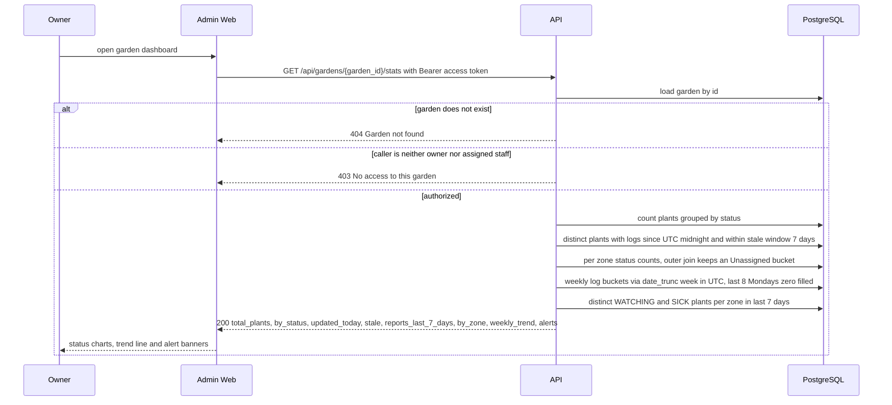
```mermaid
sequenceDiagram
  participant O as Owner
  participant W as Admin Web
  participant A as API
  participant P as PostgreSQL
  O->>W: open garden dashboard
  W->>A: GET /api/gardens/{garden_id}/stats with Bearer access token
  A->>P: load garden by id
  alt garden does not exist
    A-->>W: 404 Garden not found
  else caller is neither owner nor assigned staff
    A-->>W: 403 No access to this garden
  else authorized
    A->>P: count plants grouped by status
    A->>P: distinct plants with logs since UTC midnight and within stale window 7 days
    A->>P: per zone status counts, outer join keeps an Unassigned bucket
    A->>P: weekly log buckets via date_trunc week in UTC, last 8 Mondays zero filled
    A->>P: distinct WATCHING and SICK plants per zone in last 7 days
    A-->>W: 200 total_plants, by_status, updated_today, stale, reports_last_7_days, by_zone, weekly_trend, alerts
    W-->>O: status charts, trend line and alert banners
  end
```

Verified computation details (from `app/services/stats_service.py` and `app/core/config.py`): `stale` = `total_plants` minus the number of distinct plants that have at least one log within `stale_after_days` (default 7); `updated_today` counts distinct plants logged since UTC midnight; `weekly_trend` is exactly 8 `WeekPoint`s aligned to UTC Mondays (the query truncates with `timezone('UTC', ...)` so buckets never shift on a non-UTC connection), zero-filled for empty weeks with per-week `reports` / `sick` / `watching` counts; `by_zone` groups per zone and status with named zones sorted alphabetically and the Unassigned bucket last. An alert is emitted per symptom (WATCHING or SICK) when at least `alert_symptom_threshold` (default 5) distinct plants logged that symptom within `alert_window_days` (default 7); `dominant_zone` is the zone with the most distinct affected plants, ties broken alphabetically, and alerts are sorted by `plant_count` descending. The endpoint is purely read-only — no rows are written.

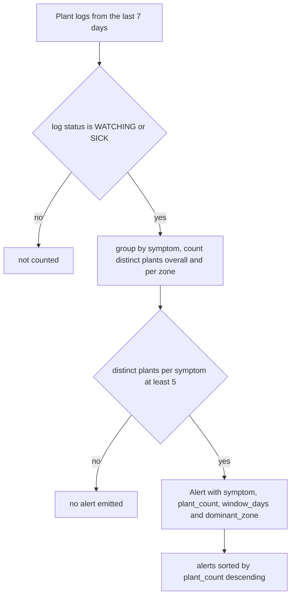
```mermaid
flowchart TD
  L[Plant logs from the last 7 days] --> S{log status is WATCHING or SICK}
  S -- no --> D[not counted]
  S -- yes --> G[group by symptom, count distinct plants overall and per zone]
  G --> T{distinct plants per symptom at least 5}
  T -- no --> N[no alert emitted]
  T -- yes --> A[Alert with symptom, plant_count, window_days and dominant_zone]
  A --> R[alerts sorted by plant_count descending]
```

---

## UC-08 — AI tổng hợp thông tin (AI garden summary)

Chủ vườn (Owner, Admin Web) requests a natural-language health summary of one garden — for example "Tuần này 15 cây vàng lá, tập trung khu A". The endpoint is owner-only (STAFF gets 403) and sits behind a Redis fixed-window rate limit; the service reuses the UC-07 aggregation primitives, picks the top 5 attention plants, and hands only structured JSON aggregates (never raw log notes, an injection-safe design) to the configured AI provider — a deterministic fake by default, or the Claude Messages API when `ai_provider=anthropic` and an API key is set.

**APIs:** `POST /api/ai/summarize`

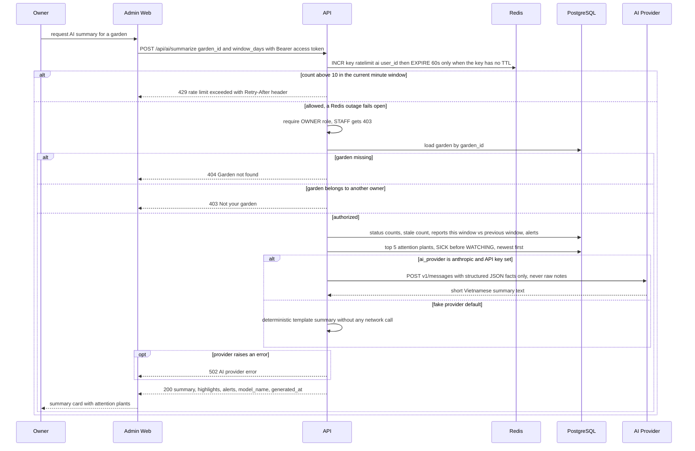
```mermaid
sequenceDiagram
  participant O as Owner
  participant W as Admin Web
  participant A as API
  participant R as Redis
  participant P as PostgreSQL
  participant M as AI Provider
  O->>W: request AI summary for a garden
  W->>A: POST /api/ai/summarize garden_id and window_days with Bearer access token
  A->>R: INCR key ratelimit ai user_id then EXPIRE 60s only when the key has no TTL
  alt count above 10 in the current minute window
    A-->>W: 429 rate limit exceeded with Retry-After header
  else allowed, a Redis outage fails open
    A->>A: require OWNER role, STAFF gets 403
    A->>P: load garden by garden_id
    alt garden missing
      A-->>W: 404 Garden not found
    else garden belongs to another owner
      A-->>W: 403 Not your garden
    else authorized
      A->>P: status counts, stale count, reports this window vs previous window, alerts
      A->>P: top 5 attention plants, SICK before WATCHING, newest first
      alt ai_provider is anthropic and API key set
        A->>M: POST v1/messages with structured JSON facts only, never raw notes
        M-->>A: short Vietnamese summary text
      else fake provider default
        A->>A: deterministic template summary without any network call
      end
      opt provider raises an error
        A-->>W: 502 AI provider error
      end
      A-->>W: 200 summary, highlights, alerts, model_name, generated_at
      W-->>O: summary card with attention plants
    end
  end
```

Verified behavior (from `app/api/routes/ai.py`, `app/core/rate_limit.py`, `app/services/ai_summary_service.py`, `app/services/ai_provider.py`): the rate-limit dependency increments the fixed-window key `ratelimit:ai:{user_id}` with `INCR` and re-asserts `EXPIRE 60` only when the key has no TTL (self-healing, so the window never slides); over `ai_rate_limit_per_minute` (default 10) it raises 429 with `Retry-After` set to the key's remaining TTL, and any Redis failure fails open so a cache outage cannot take the API down (`rate_limit_enabled=false` disables it entirely). The request body is `garden_id` (uuid, required) and `window_days` (1–90, default 7). Highlights are the 5 most attention-worthy plants — SICK ranked before WATCHING, then most recently updated — each with a Vietnamese `reason` such as "Đang bệnh". Provider selection: `ai_provider=anthropic` with `anthropic_api_key` set calls the Claude Messages API (`anthropic-version 2023-06-01`, model from `ai_model`, default `claude-sonnet-5`, 30 s timeout) with a system prompt instructing the model to treat the fenced JSON as data, not instructions; `anthropic` without a key logs a warning and falls back to the fake provider; the default `fake-summary-v1` builds a deterministic Vietnamese template including the report-count trend (tăng / giảm / không đổi vs the previous window). Any provider exception maps to 502 AI provider error. The 200 response is `AISummaryOut`: `garden_id`, `summary`, `highlights`, `alerts` (same shape as UC-07), `model_name`, `generated_at`.

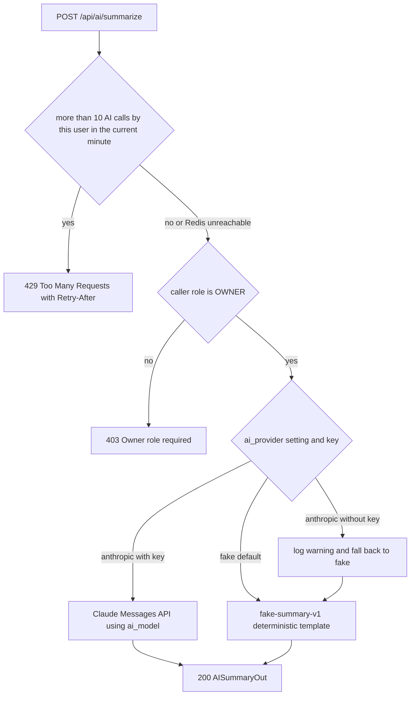
```mermaid
flowchart TD
  Q[POST /api/ai/summarize] --> RL{more than 10 AI calls by this user in the current minute}
  RL -- yes --> E1[429 Too Many Requests with Retry-After]
  RL -- no or Redis unreachable --> RO{caller role is OWNER}
  RO -- no --> E2[403 Owner role required]
  RO -- yes --> PV{ai_provider setting and key}
  PV -- anthropic with key --> AN[Claude Messages API using ai_model]
  PV -- anthropic without key --> FB[log warning and fall back to fake]
  PV -- fake default --> FK[fake-summary-v1 deterministic template]
  FB --> FK
  AN --> OK[200 AISummaryOut]
  FK --> OK
```

---

## UC-09 — Quản lý nhân viên (Staff management)

Chủ vườn (Owner, Admin Web) tạo tài khoản STAFF cho nhân viên rồi phân công họ phụ trách từng zone. Bản ghi `zone_assignments` chính là căn cứ phân quyền: nhân viên (Mobile App) chỉ đọc được vườn/cây thuộc zone mình được phân công (`is_assigned_to_garden` trong `app/core/permissions.py`). Lưu ý đã kiểm chứng trong code: gán zone KHÔNG tạo notification — push notification cho nhân viên chỉ phát sinh khi được giao task (UC-11, `task_service`).

**APIs:** `POST /api/staff`, `GET /api/staff`, `GET /api/gardens/{garden_id}/zones`, `GET /api/zones/{zone_id}/assignments`, `POST /api/zones/{zone_id}/assignments`, `DELETE /api/zones/{zone_id}/assignments/{user_id}`

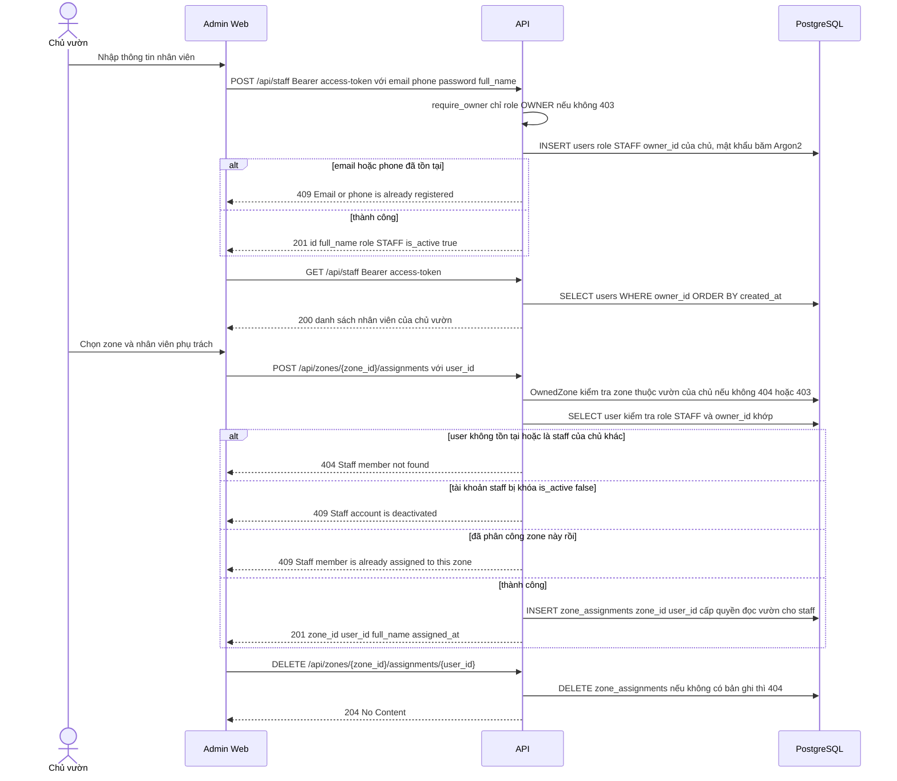
```mermaid
sequenceDiagram
  actor O as Chủ vườn
  participant W as Admin Web
  participant A as API
  participant D as PostgreSQL
  O->>W: Nhập thông tin nhân viên
  W->>A: POST /api/staff Bearer access-token với email phone password full_name
  A->>A: require_owner chỉ role OWNER nếu không 403
  A->>D: INSERT users role STAFF owner_id của chủ, mật khẩu băm Argon2
  alt email hoặc phone đã tồn tại
    A-->>W: 409 Email or phone is already registered
  else thành công
    A-->>W: 201 id full_name role STAFF is_active true
  end
  W->>A: GET /api/staff Bearer access-token
  A->>D: SELECT users WHERE owner_id ORDER BY created_at
  A-->>W: 200 danh sách nhân viên của chủ vườn
  O->>W: Chọn zone và nhân viên phụ trách
  W->>A: POST /api/zones/{zone_id}/assignments với user_id
  A->>D: OwnedZone kiểm tra zone thuộc vườn của chủ nếu không 404 hoặc 403
  A->>D: SELECT user kiểm tra role STAFF và owner_id khớp
  alt user không tồn tại hoặc là staff của chủ khác
    A-->>W: 404 Staff member not found
  else tài khoản staff bị khóa is_active false
    A-->>W: 409 Staff account is deactivated
  else đã phân công zone này rồi
    A-->>W: 409 Staff member is already assigned to this zone
  else thành công
    A->>D: INSERT zone_assignments zone_id user_id cấp quyền đọc vườn cho staff
    A-->>W: 201 zone_id user_id full_name assigned_at
  end
  W->>A: DELETE /api/zones/{zone_id}/assignments/{user_id}
  A->>D: DELETE zone_assignments nếu không có bản ghi thì 404
  A-->>W: 204 No Content
```

Chi tiết đã đối chiếu với `app/api/routes/staff.py`, `app/api/routes/zones.py`, `app/services/staff_service.py`, `app/services/zone_service.py`:

- **`POST /api/staff` (201)** — chỉ OWNER gọi được (`OwnerUser`, STAFF nhận 403 `Owner role required`). Body theo `StaffCreate` (kế thừa `RegisterRequest`): bắt buộc `password` 8–128 ký tự và `full_name` 1–100 ký tự, phải có ít nhất một trong `email` / `phone` (thiếu cả hai → 422), phone theo pattern `^\+?[0-9]{8,15}$`, email được chuẩn hóa lowercase. Trùng email/phone (unique) → 409.
- **`GET /api/staff` (200)** — owner-scoped: chỉ trả về `users` có `owner_id` = chủ đang gọi, sắp theo `created_at`.
- **`POST /api/zones/{zone_id}/assignments` (201)** — zone phải thuộc vườn của chủ (`OwnedZone`: 404 nếu zone không tồn tại, 403 nếu là vườn người khác). User được gán phải tồn tại, `role = STAFF` và `owner_id` = chủ đang gọi — staff của chủ khác trả về **404** giống như id không tồn tại (chủ ý, không lộ thông tin). Staff bị khóa (`is_active = false`) → 409. Trùng khóa chính `(zone_id, user_id)` → 409 `already assigned`. Race zone bị xóa song song (FK 23503) → 404.
- **`DELETE /api/zones/{zone_id}/assignments/{user_id}` (204)** — xóa bản ghi phân công, 404 nếu chưa từng phân công.
- **Side effect thực sự của việc gán zone:** bản ghi `zone_assignments` là nguồn phân quyền đọc — `get_readable_garden` / `get_readable_plant` cho STAFF đi qua khi tồn tại assignment trong vườn đó (spec §3: "Nhân viên giới hạn theo khu vực được phân công"). Không có bản ghi `notifications` nào được tạo ở bước này; nhân viên nhận push notification khi được giao task mới (UC-11).

---

## UC-10 — Lập lịch chăm sóc (Care schedules CRUD, cron)

Chủ vườn (Admin Web) tạo lịch chăm sóc định kỳ cho vườn — tưới, bón phân, phun thuốc — dưới dạng biểu thức cron 5 trường (`cron_expr`, ví dụ `0 6 * * 1` = 06:00 mỗi thứ Hai), tùy chọn gắn vào một zone. Một vòng lặp nền chạy ngay trong tiến trình API (bật/tắt qua `SCHEDULER_ENABLED`, chu kỳ `SCHEDULER_INTERVAL_SECONDS`) sẽ vật chất hóa mọi lịch đang active có `next_run_at` đã tới hạn thành task `PENDING` (với `due_date` = mốc lịch), rồi tính lại `next_run_at` từ thời điểm hiện tại — các lần bị bỏ lỡ được gộp thành một task duy nhất, không tạo backlog. Tất cả endpoint yêu cầu Bearer token và quyền sở hữu vườn/lịch (404 nếu không tồn tại, 403 nếu không phải vườn của mình).

**APIs:** `GET /api/gardens/{garden_id}/schedules`, `POST /api/gardens/{garden_id}/schedules`, `GET /api/schedules/{schedule_id}`, `PUT /api/schedules/{schedule_id}`, `DELETE /api/schedules/{schedule_id}`, `GET /api/tasks`

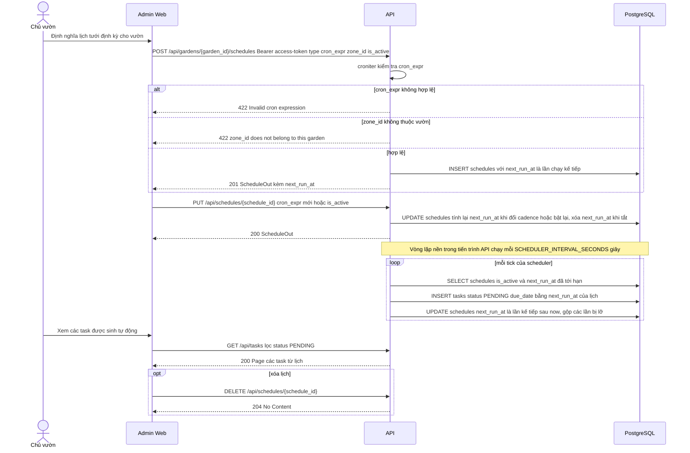
```mermaid
sequenceDiagram
  actor O as Chủ vườn
  participant W as Admin Web
  participant A as API
  participant P as PostgreSQL
  O->>W: Định nghĩa lịch tưới định kỳ cho vườn
  W->>A: POST /api/gardens/{garden_id}/schedules Bearer access-token type cron_expr zone_id is_active
  A->>A: croniter kiểm tra cron_expr
  alt cron_expr không hợp lệ
    A-->>W: 422 Invalid cron expression
  else zone_id không thuộc vườn
    A-->>W: 422 zone_id does not belong to this garden
  else hợp lệ
    A->>P: INSERT schedules với next_run_at là lần chạy kế tiếp
    A-->>W: 201 ScheduleOut kèm next_run_at
  end
  W->>A: PUT /api/schedules/{schedule_id} cron_expr mới hoặc is_active
  A->>P: UPDATE schedules tính lại next_run_at khi đổi cadence hoặc bật lại, xóa next_run_at khi tắt
  A-->>W: 200 ScheduleOut
  Note over A,P: Vòng lặp nền trong tiến trình API chạy mỗi SCHEDULER_INTERVAL_SECONDS giây
  loop mỗi tick của scheduler
    A->>P: SELECT schedules is_active và next_run_at đã tới hạn
    A->>P: INSERT tasks status PENDING due_date bằng next_run_at của lịch
    A->>P: UPDATE schedules next_run_at là lần kế tiếp sau now, gộp các lần bị lỡ
  end
  O->>W: Xem các task được sinh tự động
  W->>A: GET /api/tasks lọc status PENDING
  A-->>W: 200 Page các task từ lịch
  opt xóa lịch
    W->>A: DELETE /api/schedules/{schedule_id}
    A-->>W: 204 No Content
  end
```

---

## UC-11 — Giao việc cho nhân viên (Owner creates, assigns and tracks tasks)

Chủ vườn (Admin Web) tạo task (loại WATER/FERTILIZE/SPRAY/INSPECT/HARVEST/OTHER, tùy chọn cây cụ thể, mô tả, deadline) và gán cho một nhân viên STAFF thuộc quyền quản lý — `POST /api/tasks` yêu cầu vai trò OWNER (403 nếu là STAFF). Khi gán (lúc tạo hoặc khi đổi assignee qua PUT), một bản ghi notification `New task assigned` được chèn cho nhân viên trong cùng transaction. Chủ vườn theo dõi tiến độ qua `GET /api/tasks` (lọc theo garden, assignee, status) và có thể sửa/hủy task; đánh dấu DONE qua PUT bị từ chối 422 — phải dùng endpoint `/complete` (UC-24).

**APIs:** `GET /api/staff`, `POST /api/tasks`, `GET /api/tasks`, `GET /api/tasks/{task_id}`, `PUT /api/tasks/{task_id}`

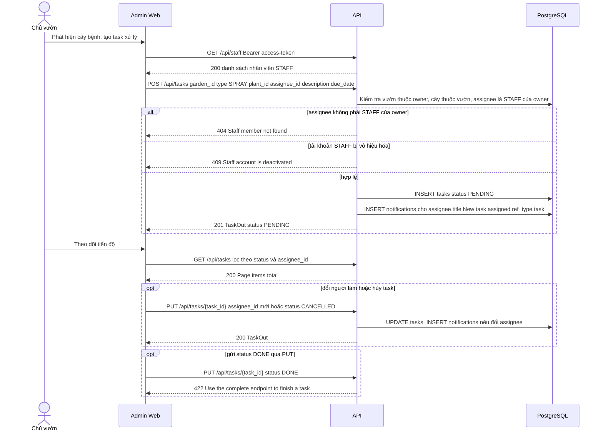
```mermaid
sequenceDiagram
  actor O as Chủ vườn
  participant W as Admin Web
  participant A as API
  participant P as PostgreSQL
  O->>W: Phát hiện cây bệnh, tạo task xử lý
  W->>A: GET /api/staff Bearer access-token
  A-->>W: 200 danh sách nhân viên STAFF
  W->>A: POST /api/tasks garden_id type SPRAY plant_id assignee_id description due_date
  A->>P: Kiểm tra vườn thuộc owner, cây thuộc vườn, assignee là STAFF của owner
  alt assignee không phải STAFF của owner
    A-->>W: 404 Staff member not found
  else tài khoản STAFF bị vô hiệu hóa
    A-->>W: 409 Staff account is deactivated
  else hợp lệ
    A->>P: INSERT tasks status PENDING
    A->>P: INSERT notifications cho assignee title New task assigned ref_type task
    A-->>W: 201 TaskOut status PENDING
  end
  O->>W: Theo dõi tiến độ
  W->>A: GET /api/tasks lọc theo status và assignee_id
  A-->>W: 200 Page items total
  opt đổi người làm hoặc hủy task
    W->>A: PUT /api/tasks/{task_id} assignee_id mới hoặc status CANCELLED
    A->>P: UPDATE tasks, INSERT notifications nếu đổi assignee
    A-->>W: 200 TaskOut
  end
  opt gửi status DONE qua PUT
    W->>A: PUT /api/tasks/{task_id} status DONE
    A-->>W: 422 Use the complete endpoint to finish a task
  end
```

---

## UC-12 — Quản lý kho vật tư (Inventory management)

Chủ vườn (Owner, Admin Web) quản lý danh mục vật tư của vườn — phân bón, thuốc BVTV, dụng cụ (`FERTILIZER`/`PESTICIDE`/`TOOL`/`OTHER`) — và ghi nhận nhập/xuất kho. Tồn kho không bao giờ được sửa trực tiếp: `quantity` khởi tạo bằng 0 và chỉ thay đổi qua giao dịch sổ cái IN/OUT (dòng vật tư bị khóa `FOR UPDATE` để hai lệnh xuất đồng thời không thể chi vượt tồn); lệnh OUT làm tồn âm bị từ chối 409, còn `quantity <= 0` trong payload bị chặn 422 ngay tại validation. Nhân viên (Staff) được gán zone trong vườn chỉ được đọc danh sách vật tư và cảnh báo tồn (sắp hết, sắp/đã quá hạn — ngưỡng 30 ngày); mọi thao tác ghi là của riêng chủ vườn.

**APIs:** `POST /api/gardens/{garden_id}/inventory`, `GET /api/gardens/{garden_id}/inventory`, `GET /api/inventory/{item_id}`, `PATCH /api/inventory/{item_id}`, `DELETE /api/inventory/{item_id}`, `POST /api/inventory/{item_id}/transactions`, `GET /api/inventory/{item_id}/transactions`, `GET /api/gardens/{garden_id}/inventory/warnings`

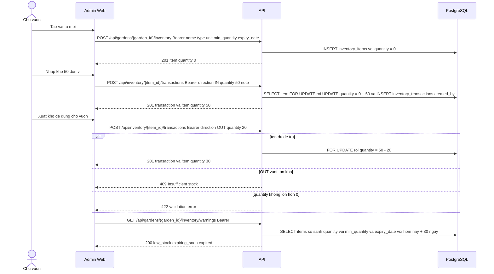
```mermaid
sequenceDiagram
  actor O as Chu vuon
  participant W as Admin Web
  participant A as API
  participant D as PostgreSQL
  O->>W: Tao vat tu moi
  W->>A: POST /api/gardens/{garden_id}/inventory Bearer name type unit min_quantity expiry_date
  A->>D: INSERT inventory_items voi quantity = 0
  A-->>W: 201 item quantity 0
  O->>W: Nhap kho 50 don vi
  W->>A: POST /api/inventory/{item_id}/transactions Bearer direction IN quantity 50 note
  A->>D: SELECT item FOR UPDATE roi UPDATE quantity = 0 + 50 va INSERT inventory_transactions created_by
  A-->>W: 201 transaction va item quantity 50
  O->>W: Xuat kho de dung cho vuon
  W->>A: POST /api/inventory/{item_id}/transactions Bearer direction OUT quantity 20
  alt ton du de tru
    A->>D: FOR UPDATE roi quantity = 50 - 20
    A-->>W: 201 transaction va item quantity 30
  else OUT vuot ton kho
    A-->>W: 409 Insufficient stock
  else quantity khong lon hon 0
    A-->>W: 422 validation error
  end
  W->>A: GET /api/gardens/{garden_id}/inventory/warnings Bearer
  A->>D: SELECT items so sanh quantity voi min_quantity va expiry_date voi hom nay + 30 ngay
  A-->>W: 200 low_stock expiring_soon expired
```

Phân loại cảnh báo tồn kho — một vật tư có thể xuất hiện đồng thời ở nhánh tồn thấp và nhánh hạn dùng:

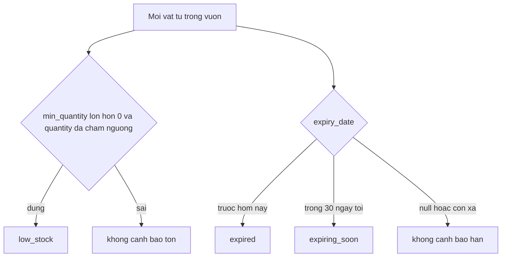
```mermaid
flowchart TD
  I[Moi vat tu trong vuon] --> L{min_quantity lon hon 0 va quantity da cham nguong}
  L -->|dung| LS[low_stock]
  L -->|sai| L0[khong canh bao ton]
  I --> E{expiry_date}
  E -->|truoc hom nay| EX[expired]
  E -->|trong 30 ngay toi| ES[expiring_soon]
  E -->|null hoac con xa| E0[khong canh bao han]
```

---

## UC-13 — Quản lý thu hoạch (Harvest records & season yield stats)

Đến mùa thu hoạch, Nhân viên (Staff, Mobile App) quét mã cây, chọn "Ghi nhận thu hoạch" và nhập sản lượng (kg), chất lượng (loại 1/2/3 — free text), mùa vụ và ngày thu hoạch; backend lưu bản ghi `harvests` với `reporter_id` là người gọi. Chủ vườn (Owner, Admin Web) — hoặc Staff được phân công zone trong vườn — xem lịch sử thu hoạch từng cây (phân trang, mới nhất trước) và bảng thống kê sản lượng toàn vườn: tổng kg + số đợt, gom nhóm theo mùa vụ (`by_season`), theo khu vực (`by_zone`, cây chưa gán zone gộp vào bucket `Unassigned`), theo chất lượng (`by_quality`). Toàn bộ tính bằng `SUM(quantity_kg)` join `harvests → plants` lọc theo `garden_id`; quyền đọc/ghi là owner hoặc staff có zone assignment trong vườn (dependency `ReadablePlant` / `ReadableGarden`).

**APIs:** `GET /api/tags/lookup/{code}`, `POST /api/plants/{plant_id}/harvests`, `GET /api/plants/{plant_id}/harvests`, `GET /api/gardens/{garden_id}/harvest-stats`

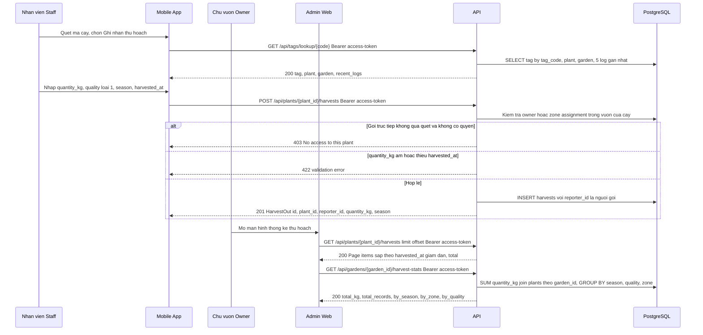
```mermaid
sequenceDiagram
  participant S as Nhan vien Staff
  participant M as Mobile App
  participant O as Chu vuon Owner
  participant W as Admin Web
  participant A as API
  participant P as PostgreSQL
  S->>M: Quet ma cay, chon Ghi nhan thu hoach
  M->>A: GET /api/tags/lookup/{code} Bearer access-token
  A->>P: SELECT tag by tag_code, plant, garden, 5 log gan nhat
  A-->>M: 200 tag, plant, garden, recent_logs
  S->>M: Nhap quantity_kg, quality loai 1, season, harvested_at
  M->>A: POST /api/plants/{plant_id}/harvests Bearer access-token
  A->>P: Kiem tra owner hoac zone assignment trong vuon cua cay
  alt Goi truc tiep khong qua quet va khong co quyen
    A-->>M: 403 No access to this plant
  else quantity_kg am hoac thieu harvested_at
    A-->>M: 422 validation error
  else Hop le
    A->>P: INSERT harvests voi reporter_id la nguoi goi
    A-->>M: 201 HarvestOut id, plant_id, reporter_id, quantity_kg, season
  end
  O->>W: Mo man hinh thong ke thu hoach
  W->>A: GET /api/plants/{plant_id}/harvests limit offset Bearer access-token
  A-->>W: 200 Page items sap theo harvested_at giam dan, total
  W->>A: GET /api/gardens/{garden_id}/harvest-stats Bearer access-token
  A->>P: SUM quantity_kg join plants theo garden_id, GROUP BY season, quality, zone
  A-->>W: 200 total_kg, total_records, by_season, by_zone, by_quality
```

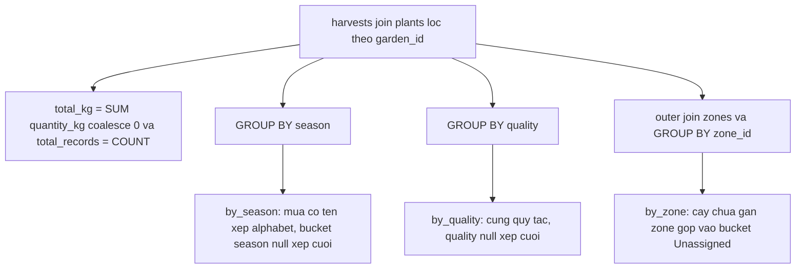
```mermaid
flowchart TD
  H[harvests join plants loc theo garden_id] --> T[total_kg = SUM quantity_kg coalesce 0 va total_records = COUNT]
  H --> S[GROUP BY season]
  H --> Q[GROUP BY quality]
  H --> Z[outer join zones va GROUP BY zone_id]
  S --> S2[by_season: mua co ten xep alphabet, bucket season null xep cuoi]
  Q --> Q2[by_quality: cung quy tac, quality null xep cuoi]
  Z --> Z2[by_zone: cay chua gan zone gop vao bucket Unassigned]
```

---

## UC-14 — Truy xuất nguồn gốc (Owner mints and manages traceability QR codes)

Chủ vườn (Owner) on Admin Web creates a **trace code** for a product batch: they pick one or more plants of the garden, an optional batch name and harvest date, plus consumer-facing `public_info` (free-form JSON, capped at 4096 serialized bytes — 422 if larger). The API generates a unique ~12-char URL-safe code (`secrets.token_urlsafe(9)`, retried up to 5 times inside a SAVEPOINT on a unique-index collision), links the batch plants via `trace_code_plants`, and Admin Web renders the QR containing the code for printing on packaging (spec §4.6). The owner can later edit the public metadata with PATCH, or **revoke the code with DELETE — a hard delete** (there is no ACTIVE/REVOKED status column in `trace_codes`; ON DELETE CASCADE removes the plant links and the public page starts returning 404). Listing uses ReadableGarden, so assigned Nhân viên (Staff) may view codes, but create/update/delete require the garden owner (403 otherwise).

**APIs:** `GET /api/gardens/{garden_id}/plants`, `POST /api/gardens/{garden_id}/trace-codes`, `GET /api/gardens/{garden_id}/trace-codes`, `GET /api/trace-codes/{trace_code_id}`, `PATCH /api/trace-codes/{trace_code_id}`, `DELETE /api/trace-codes/{trace_code_id}`

```mermaid
sequenceDiagram
  actor O as Owner
  participant W as Admin Web
  participant A as API
  participant P as PostgreSQL
  O->>W: create batch for a set of plants
  W->>A: GET /api/gardens/{garden_id}/plants Bearer access-token
  A-->>W: 200 plants to pick plant_ids from
  W->>A: POST /api/gardens/{garden_id}/trace-codes Bearer plant_ids batch_name harvest_date public_info
  A->>P: SELECT gardens WHERE id equals garden_id check owner_id
  alt caller is not the garden owner
    A-->>W: 403 Not your garden
  else some plant outside this garden
    A->>P: SELECT plants WHERE id IN plant_ids AND garden_id matches
    A-->>W: 422 plant_ids do not belong to this garden
  else valid request
    A->>A: generate code secrets token_urlsafe 9 approx 12 chars
    A->>P: INSERT trace_codes in SAVEPOINT retry up to 5 times on unique collision
    A->>P: INSERT trace_code_plants one row per plant
    A-->>W: 201 id code batch_name plant_ids public_info created_at
    W-->>O: render QR from code print on packaging
  end
  opt edit consumer-facing info
    W->>A: PATCH /api/trace-codes/{trace_code_id} Bearer public_info batch_name harvest_date
    A-->>W: 200 updated trace code
  end
  opt revoke the code
    W->>A: DELETE /api/trace-codes/{trace_code_id} Bearer
    A->>P: DELETE trace_codes cascade removes trace_code_plants
    A-->>W: 204 public page now returns 404
  end
```

```mermaid
stateDiagram-v2
  [*] --> Live: POST mint 201 unique code
  Live --> Live: PATCH batch_name harvest_date public_info 200
  Live --> Deleted: DELETE 204 hard delete cascade plant links
  Deleted --> [*]
  note right of Live : GET /api/trace/{code} returns 200
  note right of Deleted : GET /api/trace/{code} returns 404 no status column exists
```

---

## UC-20 — Đăng nhập (Staff Login on Mobile)

Nhân viên (Staff) đăng nhập Mobile App **bằng tài khoản được chủ vườn cấp** — nhân viên không thể tự đăng ký vì `POST /api/auth/register` luôn tạo OWNER. Chủ vườn tạo tài khoản qua `POST /api/staff` (yêu cầu role OWNER, nếu STAFF gọi sẽ nhận 403 Owner role required); service gán `role=STAFF` và `owner_id` trỏ về chủ vườn, cùng quy tắc định danh với đăng ký (email-hoặc-phone, email lowercase, 409 khi trùng). Nhân viên đăng nhập bằng chính `POST /api/auth/login`; tính năng Ghi nhớ phiên (spec §3.2) do app thực hiện phía client: lưu refresh token an toàn, khi mở lại app gọi `POST /api/auth/refresh` để lấy cặp token mới rồi `GET /api/auth/me` khôi phục hồ sơ — đăng xuất chỉ là xoá token phía client, không có endpoint logout.

**APIs:** `POST /api/staff`, `POST /api/auth/login`, `POST /api/auth/refresh`, `GET /api/auth/me`

```mermaid
sequenceDiagram
  actor C as Chủ vườn
  participant W as Admin Web
  actor S as Nhân viên
  participant M as Mobile App
  participant A as API
  participant P as PostgreSQL
  C->>W: Tạo tài khoản nhân viên
  W->>A: POST /api/staff kèm Bearer token của owner
  Note over W,A: payload email phone password full_name
  alt người gọi là STAFF
    A-->>W: 403 Owner role required
  else email hoặc phone đã tồn tại
    A-->>W: 409 Email or phone is already registered
  else hợp lệ
    A->>P: INSERT users role STAFF owner_id trỏ về owner
    A-->>W: 201 UserOut role STAFF
  end
  C-->>S: Bàn giao thông tin đăng nhập
  S->>M: Mở app nhập email hoặc SĐT và mật khẩu
  M->>A: POST /api/auth/login identifier password
  A->>P: SELECT user theo email lowercase hoặc phone
  alt tài khoản bị vô hiệu hoá
    A-->>M: 403 Account is deactivated
  else hợp lệ
    A-->>M: 200 access_token refresh_token
  end
  M->>M: Lưu refresh token để ghi nhớ phiên
  S->>M: Mở lại app sau này
  M->>A: POST /api/auth/refresh refresh_token
  A-->>M: 200 cặp token mới
  M->>A: GET /api/auth/me kèm Bearer access token
  A-->>M: 200 UserOut role STAFF
```

```mermaid
flowchart TD
  S[App khởi động] --> T{Có refresh token đã lưu}
  T -->|Không| L[Màn hình đăng nhập]
  T -->|Có| R[POST /api/auth/refresh]
  R -->|200 cặp token mới| H[Vào màn hình chính]
  R -->|401 token hết hạn hoặc không hợp lệ| L
  L -->|POST /api/auth/login 200| H
  H -->|Access token hết hạn sau 30 phút| R
  H -->|Đăng xuất xoá token phía client| L
```

---

## UC-21 — Quét mã cây (Scan Plant Tag)

Nhân viên (Staff) on the Mobile App points the camera at the QR/Barcode tag on a tree — or types the code manually when the tag is faded (spec §4.2). One authenticated call resolves the `tag_code` to its tag, plant, garden summary and the 5 most recent field reports, so the staff member instantly confirms they are standing at the right tree. Unknown codes and codes belonging to another owner's garden both answer **404** — tag existence is never leaked across tenants (no 403 branch by design).

**APIs:** `GET /api/tags/lookup/{code}`

```mermaid
sequenceDiagram
  actor S as Staff
  participant M as Mobile App
  participant A as API
  participant P as PostgreSQL
  S->>M: scan QR or Barcode on the tree
  M->>A: GET /api/tags/lookup/{code} with Bearer access-token
  A->>P: SELECT tag WHERE tag_code equals code
  alt code unknown or garden not owned and no zone assignment
    A-->>M: 404 Tag not found
    M-->>S: not found, offer manual code entry and rescan
  else tag resolved and caller is owner or assigned staff
    A->>P: load plant and garden, verify owner or zone assignment
    A->>P: SELECT newest 5 plant_logs ORDER BY created_at DESC
    A-->>M: 200 tag, plant, garden summary, recent_logs max 5
    M-->>S: show plant info and latest history, ready to report
  end
```

---

## UC-22 — Báo cáo tình trạng cây (Report Plant Condition)

After scanning a tree (UC-21), Nhân viên (Staff) on the Mobile App photographs it, picks a status preset (Tươi tốt / Vàng lá / Sâu bệnh...) and writes a note. Photos go **directly to MinIO** via a presigned PUT URL (valid 900 seconds, content type signed in, max 10 MiB, jpeg/png/webp only); the report then references the resulting object URLs (max 10, must be http/https). Creating the log also advances `plant.status` (validated against the §4.7 transition rules) and touches `plant.updated_at` in the same transaction, which feeds the owner's updated-today dashboard.

**APIs:** `POST /api/uploads/presign`, `POST /api/plants/{plant_id}/logs`

```mermaid
sequenceDiagram
  actor S as Staff
  participant M as Mobile App
  participant A as API
  participant O as MinIO
  participant P as PostgreSQL
  S->>M: take photos, pick status preset, write note
  M->>A: POST /api/uploads/presign content_type size_bytes with Bearer access-token
  alt content_type not jpeg png webp or size over 10 MiB
    A-->>M: 422 type or size refused
  else accepted
    A-->>M: 200 upload_url, object_url, key plants/YYYY/MM/uuid.ext, expires_in_seconds 900
  end
  M->>O: PUT photo bytes to upload_url with the same Content-Type
  Note over O: signed Content-Type must match or MinIO rejects the PUT
  O-->>M: 200 object stored
  M->>A: POST /api/plants/{plant_id}/logs status note images client_uuid with Bearer access-token
  A->>P: verify caller is garden owner or staff assigned to a zone in the garden
  alt status change breaks the transition rules, e.g. DEAD back to HEALTHY
    A-->>M: 409 illegal plant status transition
  else legal report
    A->>P: INSERT plant_logs, set plant.status and touch plant.updated_at
    A-->>M: 201 PlantLogOut with images and client_uuid
    M-->>S: report saved, history refreshed
  end
```

---

## UC-23 — Xem lịch sử cây (Quick Plant History After Scan)

Nhân viên (Staff) in the field scans a plant's QR/Barcode with the Mobile App — or types the code by hand when the tag is faded — and instantly sees the plant plus its recent history (spec §4.2 step 4: "App hiện thông tin cây và lịch sử gần nhất"). `GET /api/tags/lookup/{code}` resolves the code to `{tag, plant, garden, recent_logs}` where `recent_logs` is the 5 newest reports, giving the quick mini-history in a single round trip; tapping through loads the full paginated timeline with reporter names via `GET /api/plants/{plant_id}/timeline`. Lookup deliberately answers 404 for both unknown codes and tags belonging to another owner's garden, so tag existence never leaks across tenants; the timeline endpoint itself distinguishes 404 (missing plant) from 403 (staff not assigned to any zone in that garden).

**APIs:** `GET /api/tags/lookup/{code}`, `GET /api/plants/{plant_id}/timeline`

```mermaid
sequenceDiagram
  actor S as Staff
  participant M as Mobile App
  participant A as API
  participant P as PostgreSQL
  S->>M: scan QR or Barcode on the tree, or type the code by hand
  M->>A: GET /api/tags/lookup/{code} with Bearer access-token
  A->>P: SELECT tag by tag_code, load its plant and garden
  alt code unknown, or caller is neither garden owner nor staff assigned to a zone in it
    A-->>M: 404 Tag not found, existence never leaked across tenants
    M-->>S: ask to re-scan or re-enter the code
  else caller may read the plant
    A->>P: SELECT last 5 plant_logs ORDER BY created_at DESC
    A-->>M: 200 ScanResult tag, plant, garden summary, recent_logs up to 5
    M-->>S: plant card plus quick history of latest reports
    opt staff opens the full history
      M->>A: GET /api/plants/{plant_id}/timeline limit=20 offset=0
      A->>P: plant_logs JOIN users for reporter name, count total
      A-->>M: 200 Page of TimelineEntry log plus reporter_name
      M-->>S: scrollable timeline with photos, notes and status by date
    end
  end
```

---

## UC-24 — Nhận và thực hiện task (Staff receives and performs tasks)

Nhân viên (Mobile App) nhận thông báo giao việc qua hộp thư notification (app poll `GET /api/notifications` / `unread-count`, đánh dấu đã đọc bằng `PUT /api/notifications/{notification_id}/read`), xem danh sách task — `GET /api/tasks` với STAFF chỉ trả về task được gán cho chính họ — rồi bấm bắt đầu (`/start`: chỉ PENDING → IN_PROGRESS, ngược lại 409). Sau khi làm xong, nhân viên xin presigned PUT URL, upload ảnh xác nhận lên MinIO, và gọi `/complete` (tối đa 10 `proof_images`): task chuyển DONE, `completed_at` = now, và một notification `Task completed` được chèn cho người tạo task (chủ vườn) — trừ khi chính người tạo tự hoàn thành. Cả `/start` và `/complete` cho phép assignee hoặc chủ vườn; người khác nhận 403.

**APIs:** `GET /api/notifications`, `GET /api/notifications/unread-count`, `PUT /api/notifications/{notification_id}/read`, `GET /api/tasks`, `GET /api/tasks/{task_id}`, `PUT /api/tasks/{task_id}/start`, `POST /api/uploads/presign`, `PUT /api/tasks/{task_id}/complete`

```mermaid
sequenceDiagram
  actor S as Nhân viên
  participant M as Mobile App
  participant A as API
  participant P as PostgreSQL
  participant IO as MinIO
  M->>A: GET /api/notifications/unread-count Bearer access-token
  A-->>M: 200 unread_count
  M->>A: GET /api/notifications unread true
  A-->>M: 200 New task assigned ref_type task ref_id
  M->>A: GET /api/tasks lọc status PENDING
  A->>P: SELECT tasks WHERE assignee_id là chính STAFF
  A-->>M: 200 Page chỉ task được giao cho mình
  S->>M: Chọn task, ra vườn bắt đầu làm
  M->>A: PUT /api/tasks/{task_id}/start
  alt task không ở trạng thái PENDING
    A-->>M: 409 Only a pending task can be started
  else hợp lệ
    A->>P: UPDATE tasks status IN_PROGRESS
    A-->>M: 200 TaskOut status IN_PROGRESS
  end
  S->>M: Làm xong, chụp ảnh xác nhận
  M->>A: POST /api/uploads/presign content_type size_bytes
  A-->>M: 200 upload_url và expires_in_seconds
  M->>IO: PUT ảnh lên upload_url đã ký
  M->>A: PUT /api/tasks/{task_id}/complete proof_images
  A->>P: UPDATE tasks status DONE completed_at now proof_images
  A->>P: INSERT notifications cho người tạo task title Task completed
  A-->>M: 200 TaskOut status DONE
```

```mermaid
stateDiagram-v2
  [*] --> PENDING: POST /api/tasks hoặc scheduler sinh từ lịch UC-10
  PENDING --> IN_PROGRESS: PUT /api/tasks/{task_id}/start
  PENDING --> IN_PROGRESS: PUT /api/tasks/{task_id} status IN_PROGRESS
  PENDING --> DONE: PUT /api/tasks/{task_id}/complete
  IN_PROGRESS --> DONE: PUT /api/tasks/{task_id}/complete
  PENDING --> CANCELLED: PUT /api/tasks/{task_id} status CANCELLED
  IN_PROGRESS --> CANCELLED: PUT /api/tasks/{task_id} status CANCELLED
  DONE --> [*]
  CANCELLED --> [*]
  note right of DONE
    Trạng thái kết thúc, mọi chuyển tiếp khác trả 409
    DONE qua PUT thường trả 422, phải dùng complete
  end note
```

---

## UC-25 — Hỗ trợ Offline (Offline Support & Sync)

In the orchard the Mobile App often has no signal, so Nhân viên (Staff) reports are queued in the local DB (SQLite/WatermelonDB) with a device-generated `client_uuid` and replayed to `POST /api/plants/{plant_id}/logs` when the network returns. The server is idempotent on `client_uuid`: a replay of a report it already stored for the **same plant** returns the stored log with **200** (no duplicate row, no status change), while reusing a `client_uuid` for a **different plant** is rejected with **409**. A concurrent duplicate insert is caught by the unique index inside a SAVEPOINT, re-read, and also answered 200 — so retries are always safe.

**APIs:** `POST /api/plants/{plant_id}/logs`

```mermaid
sequenceDiagram
  actor S as Staff
  participant M as Mobile App
  participant Q as Local DB
  participant A as API
  participant P as PostgreSQL
  S->>M: submit report while offline
  M->>Q: enqueue report with device generated client_uuid
  Note over M: network returns, sync worker replays the queue
  M->>A: POST /api/plants/{plant_id}/logs with client_uuid and Bearer access-token
  A->>P: SELECT plant_logs WHERE client_uuid equals value
  alt client_uuid never seen
    A->>P: INSERT under SAVEPOINT, set plant.status and updated_at
    A-->>M: 201 new log created
    M->>Q: mark entry synced and remove
  else client_uuid already stored for this same plant
    A-->>M: 200 the stored log, created flag false, no duplicate
    M->>Q: mark entry synced and remove
  else client_uuid already used for a different plant
    A-->>M: 409 client_uuid was already used for a report on a different plant
    M-->>S: flag entry for manual resolution
  end
  Note over A: a losing concurrent insert rolls back only the SAVEPOINT, re-reads by client_uuid and answers 200
```

```mermaid
flowchart TD
  A[Report captured offline with client_uuid] --> B["Network back, replay POST /api/plants/{plant_id}/logs"]
  B --> C{Server already has this client_uuid}
  C -->|no| D[201 insert log, advance plant status]
  C -->|yes, same plant| E[200 return stored log, dedupe]
  C -->|yes, different plant| F[409 conflict, needs manual fix]
  D --> G[Dequeue locally]
  E --> G
  F --> H[Keep in queue, alert user]
```

---

## UC-26 — AI chẩn đoán bệnh (AI Leaf-Disease Diagnosis)

Nhân viên (Staff) on the Mobile App — or the Chủ vườn (Owner) — picks a leaf photo from an existing plant log (created in UC-22) and asks the AI to diagnose it. The backend enforces a per-user Redis rate limit (`ratelimit:ai:{user_id}`, fixed 60 s window, fail-open if Redis is down), authorizes owner-or-assigned-staff, and hardens against SSRF: the `image_url` must be one of that log's images AND its scheme+host+port must match the configured object store (`S3_ENDPOINT_URL`), because the vision provider fetches the image server-side (with redirects disabled). The verdict — disease (capped at 100 chars), confidence clamped to 0..1, suggestion, model_name — is persisted as an `ai_diagnoses` row attached to the plant log and returned with a Vietnamese advisory disclaimer; a provider failure yields 502. Later reads of the plant's logs/timeline embed the `diagnoses` array on each log.

**APIs:** `POST /api/ai/diagnose`, `GET /api/plants/{plant_id}/logs`, `GET /api/plants/{plant_id}/timeline`

```mermaid
sequenceDiagram
  participant S as Nhan vien Staff
  participant M as Mobile App
  participant A as API
  participant R as Redis
  participant P as PostgreSQL
  participant O as MinIO
  participant V as AI Provider
  S->>M: chọn ảnh lá trong nhật ký cây đã báo cáo ở UC-22
  M->>A: POST /api/ai/diagnose plant_log_id, image_url với Bearer access-token
  A->>R: INCR ratelimit:ai:user_id và EXPIRE 60s nx
  alt vượt ai_rate_limit_per_minute
    A-->>M: 429 rate limit exceeded, header Retry-After
  else còn hạn mức
    A->>P: đọc plant_log, plant, garden và kiểm tra quyền
    alt log không tồn tại
      A-->>M: 404 Plant log not found
    else không phải owner và không được gán vào garden
      A-->>M: 403 No access to this plant log
    else image_url không thuộc log.images hoặc khác object store đã cấu hình
      A-->>M: 422 Unprocessable Content
    else ảnh hợp lệ
      A->>V: diagnose image_url
      opt provider anthropic có API key
        V->>O: GET image_url, không follow redirect
        O-->>V: bytes ảnh jpeg png webp
        Note over V: gọi Claude vision, đọc JSON disease confidence suggestion
      end
      V-->>A: disease, confidence 0..1, suggestion
      A->>P: INSERT ai_diagnoses gắn plant_log_id kèm model_name
      A-->>M: 200 plant_log_id, diagnosis, disclaimer tham khảo
      M-->>S: hiện bệnh dự đoán, độ tin cậy và gợi ý xử lý
      opt xem lại lịch sử
        M->>A: GET /api/plants/{plant_id}/timeline với Bearer access-token
        A-->>M: 200 mỗi log kèm mảng diagnoses
      end
    end
  end
```

The validation gate and provider selection branch as follows — the SSRF guard and the graceful capping of the model's reply are the two hardening steps verified in `diagnosis_service.py` / `vision_provider.py`:

```mermaid
flowchart TD
  A[image_url trong request] --> B{bắt đầu bằng http hoặc https}
  B -- không --> V0[422 validation của schema]
  B -- có --> C{có nằm trong log.images}
  C -- không --> E1[422 image_url is not one of this logs images]
  C -- có --> D{scheme host port trùng với S3_ENDPOINT_URL}
  D -- không --> E2[422 must reference the configured object store]
  D -- có --> F{vision_provider}
  F -- fake hoặc thiếu API key --> G[FakeVisionProvider fake-vision-v1 deterministic theo sha256 của URL]
  F -- anthropic và có API key --> H[AnthropicVisionProvider tải ảnh từ MinIO rồi gọi Claude]
  H --> I[cắt disease còn 100 ký tự và clamp confidence về 0..1]
  G --> J[INSERT ai_diagnoses]
  I --> J
  H -- lỗi provider --> E3[502 Vision provider error]
  J --> K[200 kèm disclaimer tiếng Việt chỉ mang tính tham khảo]
```

---

## UC-30 — Quét QR truy xuất (Consumer scans product QR — public trace page)

Khách / Người tiêu dùng (Consumer) buys the product and scans the QR printed on the packaging; their browser opens the public trace page, which calls `GET /api/trace/{code}` **without any authentication**. The API resolves the code, then aggregates over the batch plants: planting range (min/max `planted_at`), care summary (count of `plant_logs` rows plus last care timestamp), and harvest totals (sum of `quantity_kg` plus latest `harvested_at`). The response is deliberately narrow (spec §4.6): garden name and address, variety from `gardens.plant_type`, plant count, batch info, and the owner-curated `public_info` — no internal IDs, owner or staff identities, or raw plant statuses. An unknown or revoked (deleted) code returns 404.

**APIs:** `GET /api/trace/{code}`

```mermaid
sequenceDiagram
  actor C as Consumer
  participant B as Browser
  participant A as API
  participant P as PostgreSQL
  C->>B: scan QR on product packaging
  B->>A: GET /api/trace/{code} no Authorization header needed
  A->>P: SELECT trace_codes WHERE code equals scanned code
  alt code unknown or already revoked by delete
    P-->>A: no row
    A-->>B: 404 Trace code not found
    B-->>C: invalid code page
  else code found
    A->>P: SELECT garden name address plant_type
    A->>P: SELECT plant_ids FROM trace_code_plants
    A->>P: SELECT min and max planted_at for batch plants
    A->>P: SELECT count and max created_at FROM plant_logs
    A->>P: SELECT sum quantity_kg and max harvested_at FROM harvests
    A-->>B: 200 code batch_name harvest_date variety garden plant_count planted_from planted_to total_harvested_kg latest_harvest_at care_reports last_care_at public_info
    B-->>C: public page variety garden address planting dates care history harvest totals certifications
  end
```
